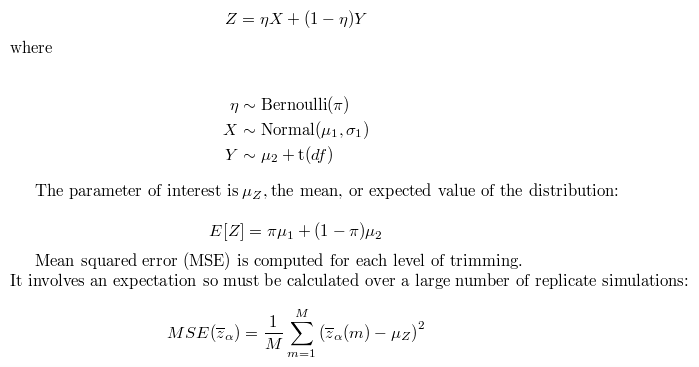
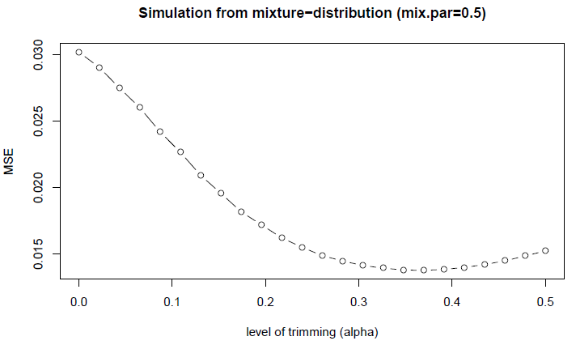

# Practical 3

## Description
The simulation study looks at the performance of a robust estimator of a sample mean.  

This estimator is the _trimmed mean_, more robust to outliers than the standard type of mean.  Consult your favourite statistical resource to learn more about trimmed means.  We will generate data from an awkward distribution and see how the trimmed mean performs.  Our measure of performance will be the mean squared error (MSE) -- i.e., the average of the squared difference between estimated mean and true mean.  The smaller the MSE, the closer, on average, the estimated mean is to the true mean.  We will try different levels of trimming, from alpha=0 (i.e., the mean), through 0.1 (i.e., 10% smallest and 10% largest values from the samples deleted) to a maximum of 0.5, which is the sample median (because all other observations have been trimmed away leaving only the median value).

The distribution we will use is a mixture of a normal with a non-central *t* distribution.  The random variable of interest **Z** is defined as

If we construct our mixture distribution (each of sample size 30) with pi=0.5, mu1=5, sigma1=2, mu2=7 and df=3 and generate 1000 replicates for each trimming level, MSE as a function of alpha resembles this

## Team task

I have provided five functions in this repository, however some of them are incomplete.  After having joined your assigned Github team, your team is to edit these functions to make them whole, commit the modified files back to the team repository, create a *release* of the repaired functions *(then what)?*

The functions and their purposes:

* `do.sim.r()`
    * runs the simulations by creating replicate datasets of the mixture distribution, computing the trimmed means, expected value of the distribution and mean square error
* `mix.dist.r()`
    * generates data from mixture distribution
* `get.expectation()`
    * calculates expected value of distribution with specified parameters
* `estimate.mean()`
    * calculate trimmed means (these are estimates of the expected value)
* `mean.square.error()`
    * compute the mean square error for each of the trim levels
